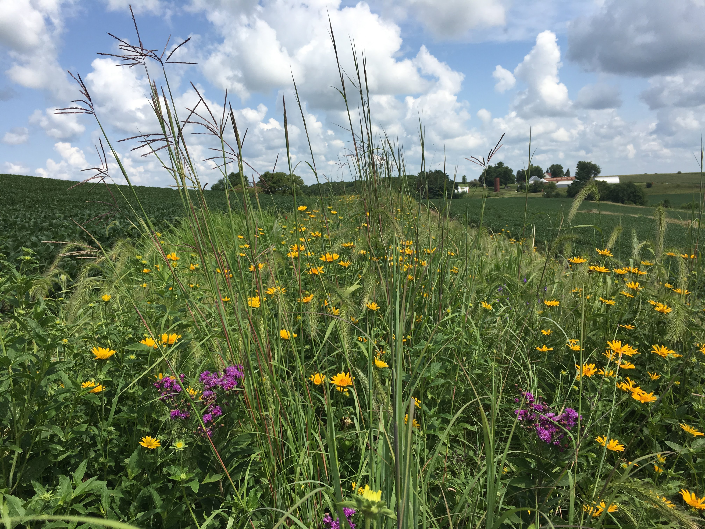
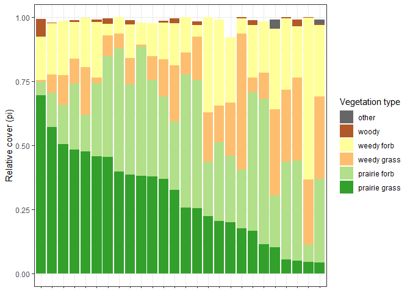

<!-- README.md is generated from README.Rmd. Please edit that file -->

# STRIPS2veg

<!-- badges: start -->

[](https://www.tidyverse.org/lifecycle/#maturing)
<!-- badges: end -->

#### Overview

`STRIPS2veg` is an R package that houses data from Lydia English’s
Masters Thesis at Iowa State Univeristy. The data in `STRIPS2veg`
consist of vegetation information from surveys conducted in the summers
of 2018 and 2019 on farms across the state of Iowa that have installed
prairie strips.

You may be asking…what are prairie strips?



Prairie strips are a farming conservation practice whereby native,
prairie habitat is planted within or at the edge of crop fields. By
incorporating the deep roots and stiff stems of native prairie
vegetation, prairie strips not only provide increased water
infiltration, erosion control, and nutrient export from fields, but they
also provide Iowa with much needed habitat for pollinators, birds, and
other native taxa. To find out more information about the project and
see to updates, check out the
[website](https://www.nrem.iastate.edu/research/STRIPS/).

#### Summary of Package Contents

This package currently 5 dataframes:

1.  `all_site_info` contains general information about each site visited
    throughout the study period.
2.  `strips` contains the ID, area, and perimeter of all strips in a
    site
3.  `quadrats` contains the ID and anonymized location of all quadrats
    (sampling points) visited in a site.
4.  `vegetation` contains the cover data (abundance information)
    recorded at every quadrat in every site.
5.  `species_list` contains taxonomic and life-history information for
    all the plant species found throughout the study.

Each of the dataframes can accessed by utilizing the `data()` call after
loading the library. More detailed annotationed can be found in the help
pages (ex: `?species_list`)

``` r
library(STRIPS2veg)
data("vegetation")
head(vegetation)
#>   year quadratID siteID speciesID cover                notes flowering
#> 1 2018   wat_1_1    WAT     elyvi   1-5                 <NA>      <NA>
#> 2 2018   wat_1_1    WAT     elyca  5-25                 <NA>      <NA>
#> 3 2018   wat_1_1    WAT     dacgl  5-25 unkn grass #1;sample      <NA>
#> 4 2018   wat_1_1    WAT     plama   1-5                 <NA>      <NA>
#> 5 2018   wat_1_1    WAT     ambar  5-25                 <NA>      <NA>
#> 6 2018   wat_1_1    WAT     conca  5-25                 <NA>      <NA>
```

## Installation

You can install the development version of STRIPS2veg from
[GitHub](https://github.com/) with:

``` r
# install.packages("remotes")
remotes::install_github("lydiaPenglish/STRIPSveg")
```

## Example

#### Making a summary plot

Here is an example of how to calculate the relative cover
(p<sub>i</sub>) of each species at every site in 2019.

``` r
library(STRIPS2veg)
library(tidyverse)
#> Warning: package 'ggplot2' was built under R version 3.6.3
#> Warning: package 'dplyr' was built under R version 3.6.3
data("vegetation")

pi_2019 <- vegetation %>%
  filter(year == "2019") %>%
  # Recoding our cover classes into midpoint values
  mutate(midpoint = dplyr::recode(cover, 
                                  '<1' = "0.5",
                                  '1-5' = "3",
                                  '5-25' = "15", 
                                  '25-50' = "37.5",
                                  '50-75' = "62.5", 
                                  '75-95' = "85", 
                                  '>95' = "97.5"),
         midpoint = as.numeric(as.character(midpoint))) %>%
  group_by(siteID, speciesID) %>%
  # Calculating total values of cover for each species at each site
  summarize(spp_cover = sum(midpoint)) %>%
  group_by(siteID) %>%
  # calculating total cover (all species in a site)
  mutate(total_cover = sum(spp_cover),
         # pi = the proportion of the total cover that is attributed by each species
         pi         = spp_cover/total_cover) %>%
  ungroup()

pi_2019
#> # A tibble: 1,221 x 5
#>    siteID speciesID spp_cover total_cover       pi
#>    <chr>  <chr>         <dbl>       <dbl>    <dbl>
#>  1 ARM    amare           1.5        3172 0.000473
#>  2 ARM    andge          82.5        3172 0.0260  
#>  3 ARM    aquca           6          3172 0.00189 
#>  4 ARM    ascsy          60          3172 0.0189  
#>  5 ARM    asctu           3          3172 0.000946
#>  6 ARM    boucu          42          3172 0.0132  
#>  7 ARM    broin         162.         3172 0.0512  
#>  8 ARM    carvu          18          3172 0.00567 
#>  9 ARM    chafa           6          3172 0.00189 
#> 10 ARM    cheal          15          3172 0.00473 
#> # ... with 1,211 more rows
```

The relative cover (p<sub>i</sub>) standardizes all the absolute cover
values to 1, with the result that it becomes easier to compare across
sites that may vary in their absolute abundances.

We can now join this dataframe with our species list and summarize by
total p<sub>i</sub> by functional group

``` r
data("species_list")

site_pi <- pi_2019 %>%
  left_join(., species_list, by = "speciesID") %>%
  group_by(siteID, group_simple) %>%
  summarize(grp_pi = sum(pi)) %>%
  # filter out the NAs, which were "unknown" plants that were never identified 
  filter(!(is.na(group_simple))) %>%
  ungroup()

site_pi
#> # A tibble: 124 x 3
#>    siteID group_simple  grp_pi
#>    <chr>  <chr>          <dbl>
#>  1 ARM    prairie forb  0.518 
#>  2 ARM    prairie grass 0.257 
#>  3 ARM    weedy forb    0.139 
#>  4 ARM    weedy grass   0.0853
#>  5 BUE    prairie forb  0.260 
#>  6 BUE    prairie grass 0.199 
#>  7 BUE    weedy forb    0.253 
#>  8 BUE    weedy grass   0.208 
#>  9 DMW    prairie forb  0.0527
#> 10 DMW    prairie grass 0.694 
#> # ... with 114 more rows
```

Lastly, we can make a graph of the p<sub>i</sub> of different functional
groups by sites to get an idea how sites vary in their cover of
different vegetation groups (i.e. target and non-target). In order to
beautify this plot we will need to go through a few extra steps…

``` r
# ordering sites by relative cover of prairie grasses instead of alphabetically 
ord <- site_pi %>% 
  filter(group_simple == "prairie grass") %>% 
  arrange(desc(grp_pi)) %>% 
  magrittr::extract2("siteID")

# colors for the different functional groups
mycols <- c("#666666", "#B15928",  "#FFFF99", "#FDBF6F", "#B2DF8A", "#33A02C")

site_pi %>%
  mutate(siteID = factor(siteID, ord)) %>%
  ggplot(aes(siteID, grp_pi))+
  geom_col(aes(fill = factor(group_simple, 
                             levels = c("other", "woody", "weedy forb", 
                                        "weedy grass", "prairie forb",
                                        "prairie grass"))))+
  scale_fill_manual(values = mycols)+
  labs(fill = "Vegetation type",
       x = NULL,
       y = "Relative cover (pi)")+
  theme_bw()+
  theme(axis.text.x = element_blank())
```



Looks like some sites have nice cover of the target vegetation (prairie
grasses and forbs - green bars) while other sites are dominated by
non-target vegetation (weedy grasses and forbs - yellow and orange bars)
